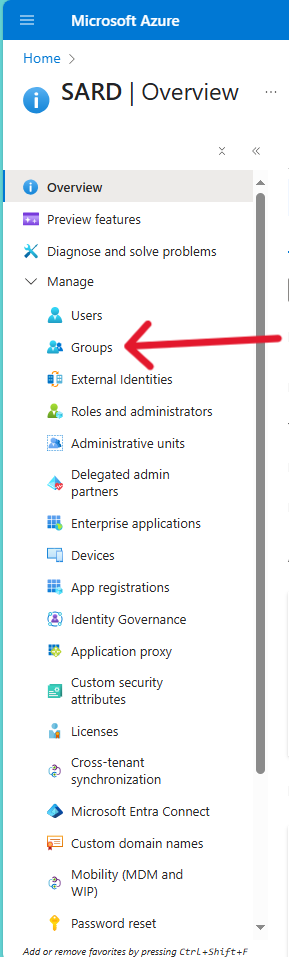
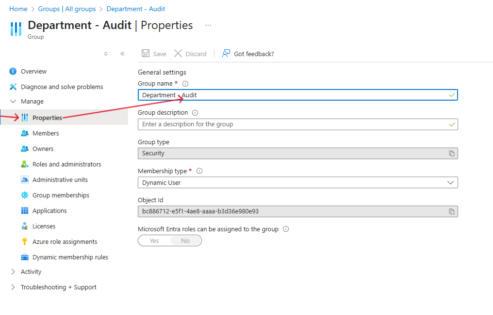

## Steps to Check a Dynamic Membership Rule

1. **Sign in** to the [Microsoft Entra admin center](https://entra.microsoft.com/).

2. In the left-hand menu, go to **Groups**.

3. Click **All groups**.

4. Locate and click the **group** you want to inspect.

5. In the group menu, select **Properties**.

# 
OR

6. Click on **Dynamic membership rules under Manage** (if available).

7. The rule will be displayed in the **Rule syntax** box.

