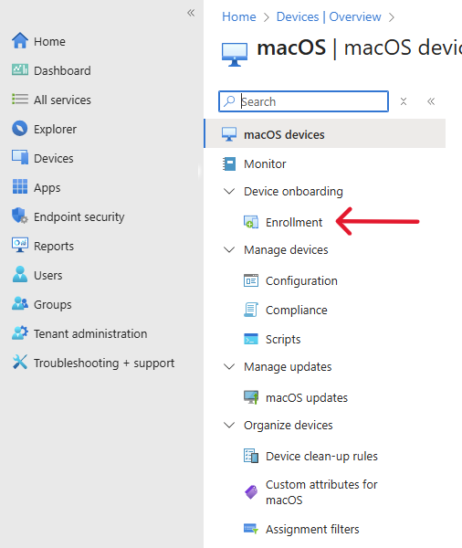

## 📝 Enrollment Steps

⚠️ *If the Mac had a prior profile, retire it before attempting a data erase.*

###  Download Apple Configurator on your phone

1. Open **Apps Store**  and download  **apple configurator**.
2. Open the Apple Configurator app and proceed through through initial setup. The app must be signed in with a user account from the ASM or ABM account which has been assigned the "Device Enrollment Manager" role. Grant the Bluetooth and camera permissions when prompted, both are required for the enrollment process.

### Step 1: Prepare the Target Mac

1. Power on the **target macOS device**.
2. Proceed through **language selection**.

3. On the **"Country or Region"** selection screen — **STOP** here.

4. The Mac will display a **pairing screen** with a globe.

5. Scan the **pairing screen** with a app called **Configurator** and let the Mac to process the pairing.

### Step 2: Assign Device to Microsoft Intune in ABM/ASM

1. Go to [business.apple.com](https://business.apple.com).

2. Sign in and navigate to Devices > Search for your Mac

3. Select the Mac (it will show as **"Devices Added by Apple Configurator "**).
4. Click ** ... ** **Edit MDM Server**.

5. Choose the **Intune MDM server** and click **Done**.

### Step 3: Assign Enrollment Profile in Intune

1. Go to [Microsoft Intune Admin Center](https://intune.microsoft.com).

2. Navigate to Devices > macOS 

3. Then **Enrollment**

4. Then to **Enrollment Program Tokens**

5. Select the appropriate **DEP Token**.

6. Click on **Devices**, then click **Sync** to fetch latest device list.

7. Locate the target Mac.

8. Click **Assign profile**.

9. Choose the existing **macOS enrollment profile**.

10. Click **Apply** or **OK**.

---

### Step 5: Complete Setup on the Target Mac

1. Continue the setup process on the target Mac:
- Choose country/region
- Connect to Wi-Fi
2. Click **“Enroll”** to proceed:
> "*[Your Organization] will automatically configure this Mac*"
3. Click **Continue**.
4. Authenticate using your **Microsoft 365 account** credentials.
5. The Mac will **automatically enroll into Intune** and apply all assigned policies and profiles.

---

