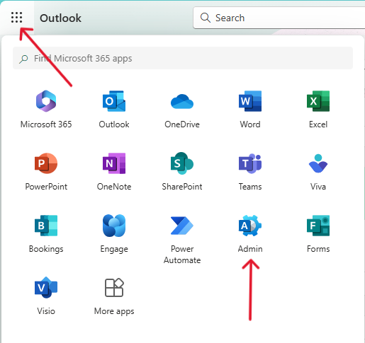

# How to Reset a User’s Email Password in Microsoft 365

## Password Reset Steps

1. **Sign in** to your Microsoft 365 admin account.
2. Click the **App Launcher** (the grid icon at the top-left corner) and select **Admin**.

3. In the **Admin Center**, click **Show All**, then select **Microsoft Intune**.

4. In the **Microsoft Intune Admin Center**, go to **Users**.

5. **Search** for the user whose password you want to reset and click on their name.

6. Click **Reset Password**

, then confirm the reset.

7. **Copy the new password** and share it securely with the user.

---

## Optional: Re-request Multi-Factor Authentication (MFA) Setup

1. In the user's profile, navigate to **Authentication Methods**.
At the top, click **"Require re-register multifactor authentication"**.

3. Click **OK** to confirm.

The user will now be prompted to set up their authentication method again, including configuring a new authenticator app.
