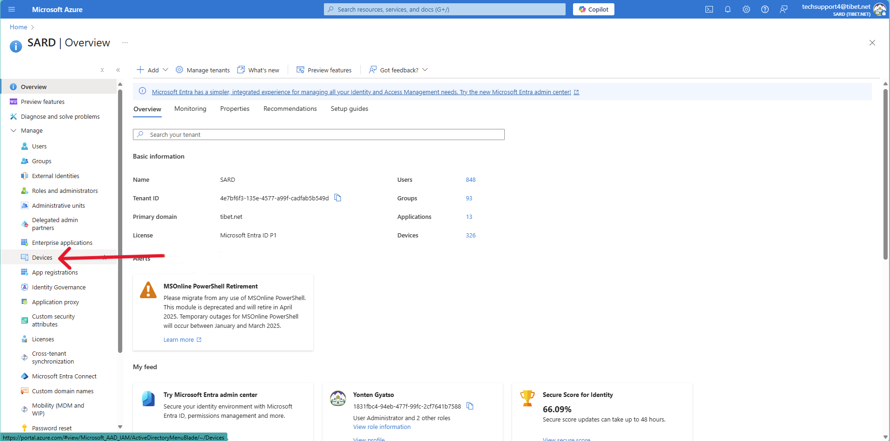
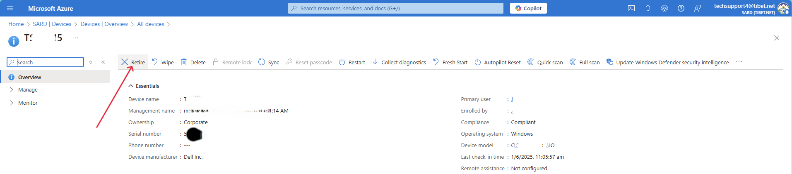

# 🔧 How to Retire Devices from Microsoft Entra ID

This guide explains how to retire or delete stale, unused, or decommissioned devices from Microsoft Entra ID (formerly Azure AD).

---

## 📌 Prerequisites

- **Global Administrator**, **Cloud Device Administrator**, or **Intune Administrator** role.
- Access to [Microsoft Entra Admin Center](https://portal.azure.com/).
- Optional: Access to **Microsoft Intune Admin Center** if managing via Intune.

---

## ✅ Step-by-Step: Retire Devices via Entra Admin Center

1. Go to [https://portal.azure.com](https://portal.azure.com)

2. Select Microsoft Entra ID:

3. In left-hand menu, select the **Devices** section, you will see an overview of all devices enrolled in Microsoft Entra ID.

4. Locate and **select the list of devices** that have been successfully rolled out.

5. Use the **search bar** at the top to find the specific device by name.

6. Once the device appears in the results, **select the device**.

7. Click on the **"Manage"** option at the top of the page.

8. In the management toolbar, click on the **"Retire"** button.

9. Confirm the action to **retire the device** from Microsoft Entra.

> ℹ️ Retiring a device removes it from active management but does not factory reset it. For a full wipe, consider using the **Wipe** option from Microsoft Intune if applicable.
