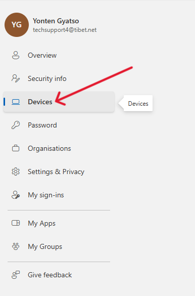

### Steps to Unlock BitLocker with Microsoft Account Bitlocker Recovery Key

#### 1. **Login into Your Microsoft Account**
   - Open your preferred web browser and go to the official [Microsoft account login page](https://account.microsoft.com). 
   - Enter your **email address** and **password** associated with your Microsoft account, then click **Sign in**.
   - Make sure to use the same Microsoft account that is linked to your device where BitLocker is enabled.

#### 2. **Navigate to "View Account"**
   - Once logged in, you'll be directed to the **Microsoft account home page**. Look for your **profile icon** or your **name** in the top-right corner of the page. 
   - Click on **View account** or **Your Info** to proceed to your account management page, where you can view and manage details associated with your device and security settings.

   

#### 3. **Go to "Devices"**
   - In the account management section, look for the **Devices** tab located in the main menu. 
   - This is where all the devices linked to your Microsoft account will be listed, such as PCs, tablets, and other devices with BitLocker encryption enabled.
   - Click on the **Devices** tab to see a list of your registered devices.

#### 4. **Select Your Current Device**
   - From the list of devices displayed, find and select the **current device** that is asking for the BitLocker recovery key. This should be the device that has BitLocker encryption enabled and is currently locked, preventing you from accessing your system.
   - Click on the **device name** to view its details.

 

#### 5. **Click on "View BitLocker Keys"**
   - On the device details page, you’ll find several options related to the device. Look for the section or button labeled **View BitLocker Keys**.
   - This option will allow you to access the BitLocker recovery key associated with your device. Click this to proceed.

 

#### 6. **Click on "Show Recovery Key" Under Operating System Drive**
   - In the **BitLocker keys** section, you will see multiple recovery keys listed for your device. Find the entry under the **Operating System Drive** (usually labeled with the drive letter, typically **C:**, where Windows is installed).
   - Click on **Show recovery key**. This will reveal the **48-digit BitLocker recovery key** needed to unlock your system.

 

#### 7. **Enter or Copy the Recovery Key**
   - Once the recovery key is revealed, you have two options:
     1. **Type the Recovery Key**: Carefully type the **48-digit recovery key** manually into the prompt on your locked system. Ensure there are no errors when typing, as even a single mistake can prevent the system from unlocking.
     2. **Copy and Paste the Recovery Key**: Alternatively, you can **copy the key** from the Microsoft account page and then **paste it** directly into the BitLocker prompt on your device. This is often easier and reduces the risk of typos.
   - After entering the correct recovery key, your system will authenticate the key and unlock the **BitLocker-encrypted drive**. Your device will then grant you access to the operating system and all of your files.

---

Once successfully entered, the **BitLocker encryption** will be disabled temporarily, allowing you to boot into Windows and access your data. If needed, you can re-enable BitLocker encryption after the system is fully accessible and working. Make sure to store the recovery key in a secure location for future reference, as it is critical for accessing encrypted data should any future issues arise.
