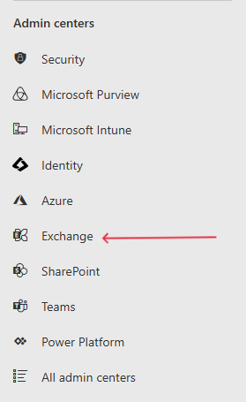
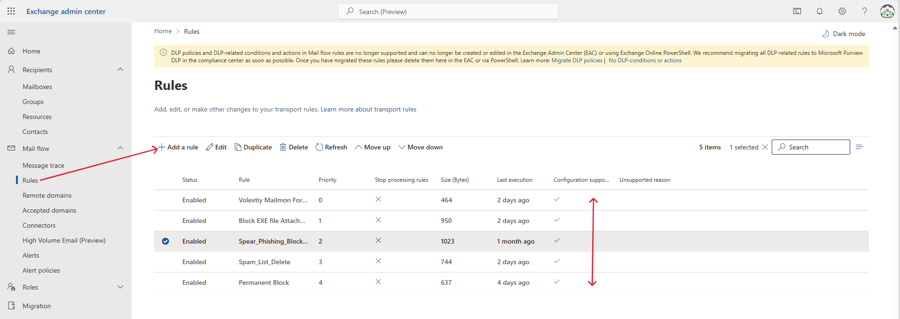
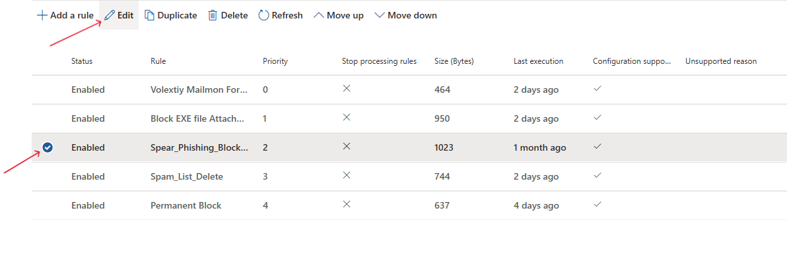

## Manual Blocking of Spear Phishing Emails in Microsoft 365 Admin Center

### Step 1: Sign in to Microsoft 365 Admin Center
- Navigate to https://admin.microsoft.com.
- Log in using your **Global Administrator** or **Security Administrator**credentials.

---

### Step 2: Access Exchange Admin Center (EAC)
- In the left-hand navigation pane, go to:
  **Admin centers > Exchange**
- This will open the **Exchange Admin Center** in a new browser tab.

---

### Step 3: Create a Mail Flow Rule to Block Sender/Domain
1. In the Exchange Admin Center, go to:
   **Mail Flow > Rules**

2. Click **+ Add a rule** > **Create a new rule**.

3. Enter a name for the rule (e.g., `Block Spear Phishing Sender`).

4. Under **Apply this rule if**:
   - Select **The sender is** and add the suspicious email address or domain.

5. Under **Do the following**:
   - Choose **Delete the message without notifying anyone** or **Quarantine the message**.

6. Click **Save**, review the settings, and then click **Save** to activate the rule.